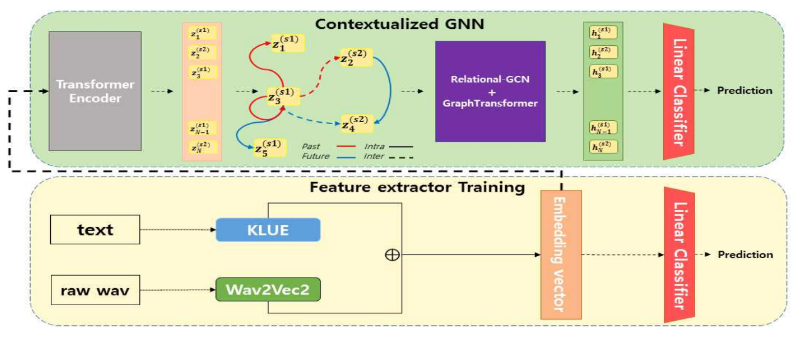
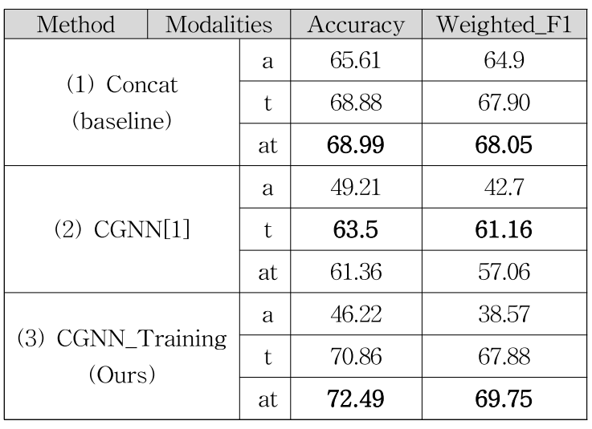

ETRI_Multimodal_ER
=================
* ETRI 멀티모달 감정인식 대회
* Data: KEMDy19
* Modality : Audio, Text 
* Title : 'Contextualized GNN구조를 활용한 한국어 대화에서의 멀티모달 감정인식'

Installation

# requirements
##libraries
* torch
* transformers
* pytorch-lightning
* PyTorch Geometric
* Comet 
* pandas
* librosa
* sklearn
<pre>
<code>

</code>
</pre>
## pretrained models
* sbert
<pre>
<code>

</code>
</pre>

# preprocess
------------
preprocess, Train, Evaluation실행 관련해선 COGMEN_code/run_eval.sh 참조
cogmen formatting.py로 나온 Csession, test, train 정보를 바탕으로
<pre>
<code>

%cd COGMEN_code
python preprocess.py --res_dir=
</code>
</pre>
# Train
------------
'''

'''
# Evaluation
------------
'''
'''

# citation
-------------
[1] K. J. Noh and H. Jeong, “KEMDy19,” https://nanum.etri.re.kr/share/kjnoh/KEMDy19?lang=ko_KR 
[2] Joshi, Abhinav, et al. "COGMEN: COntextualized GNN based multimodal emotion recognitioN." arXiv preprint arXiv:2205.02455 (2022).
# acknowledgements
---------------
The structure of our code is inspired by <https://github.com/Exploration-Lab/COGMEN> and <https://github.com/Mirai-Gadget-Lab/Multimodal_Emotion_Recognition>
